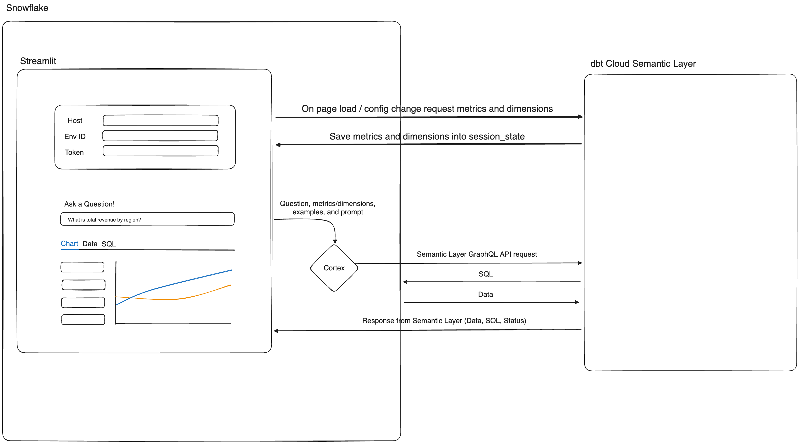

# Overview

This repo contains the code used to create the streamlit in snowflake app mentioned in this blog post.  There are two files:

- snowflake.sql - Contains all relevant snowflake code to be execute
- app.py - Contains all of the code to power the streamlit app

Please open up an issue here if you encounter any problems.

# Architecture

The diagram below shows the flows within the application.

The inspiration for this app started [here](https://dbt-semantic-layer.streamlit.app)
